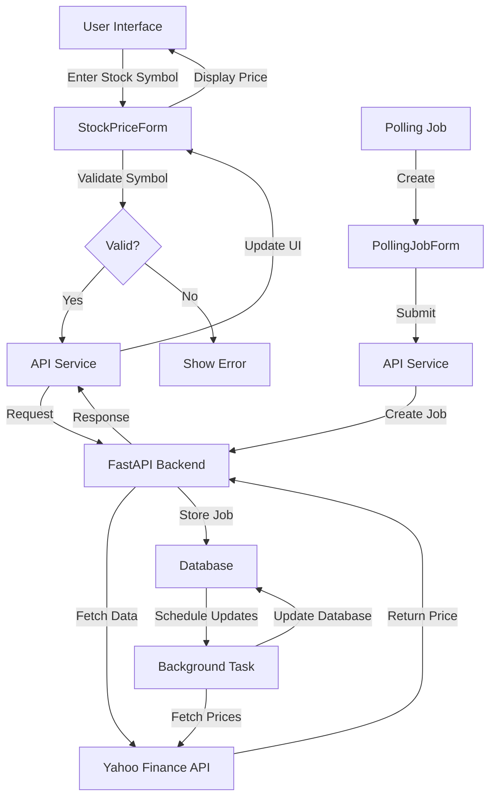

# Market Data Dashboard

A real-time stock market data dashboard built with FastAPI and React, featuring Swiss design principles and real-time price updates.

## 🚀 Features

- Real-time stock price updates
- Polling mechanism for continuous price monitoring
- Modern UI with Swiss design principles
- Dark/Light theme support
- Responsive design
- Error handling and validation
- Common stock symbols autocomplete

## 📋 Prerequisites

- Python 3.8+
- Node.js 16+
- npm or yarn
- Git

## 🛠️ Installation

### Backend Setup

1. Clone the repository:

```bash
git clone https://github.com/hanugopavarapuu/Market.git
cd Market
```

2. Create and activate a virtual environment:

```bash
python -m venv venv
source venv/bin/activate  # On Windows: venv\Scripts\activate
```

3. Install Python dependencies:

```bash
cd app
pip install -r requirements.txt
```

4. Start the FastAPI server:

```bash
uvicorn api.main:app --reload --port 8000
```

### Frontend Setup

1. Navigate to the frontend directory:

```bash
cd frontend
```

2. Install dependencies:

```bash
npm install
# or
yarn install
```

3. Start the development server:

```bash
npm run dev
# or
yarn dev
```

## 📁 Project Structure

```
Market/
├── app/                    # Backend directory
│   ├── api/               # FastAPI application
│   │   ├── main.py       # Main FastAPI application
│   │   ├── models.py     # Database models
│   │   └── services.py   # Business logic
│   ├── requirements.txt   # Python dependencies
│   └── .env              # Environment variables
│
├── frontend/              # React frontend
│   ├── src/
│   │   ├── components/   # React components
│   │   ├── services/     # API services
│   │   ├── theme.ts      # Theme configuration
│   │   └── App.tsx       # Main application
│   ├── package.json      # Node.js dependencies
│   └── vite.config.ts    # Vite configuration
│
└── README.md             # Project documentation
```

## 🔄 Application Flow



## 🔧 Environment Variables

Create a `.env` file in the `app` directory with the following variables:

```env
DATABASE_URL=sqlite:///./market.db
YAHOO_FINANCE_API_KEY=your_api_key
```

## 🚀 API Endpoints

- `GET /api/v1/prices/latest?symbol={symbol}` - Get latest price for a symbol
- `POST /api/v1/prices/poll` - Create a polling job
- `GET /api/v1/prices/history?symbol={symbol}` - Get price history

## 🎨 UI Components

- `StockPriceForm`: Main form for fetching stock prices
- `PollingJobForm`: Form for creating polling jobs
- Theme toggle for dark/light mode
- Responsive layout with Material-UI components

## 🛠️ Development

### Backend Development

```bash
cd app
uvicorn api.main:app --reload --port 8000
```

### Frontend Development

```bash
cd frontend
npm run dev
# or
yarn dev
```

## 📝 License

This project is licensed under the MIT License - see the LICENSE file for details.

## 👥 Contributing

1. Fork the repository
2. Create your feature branch (`git checkout -b feature/AmazingFeature`)
3. Commit your changes (`git commit -m 'Add some AmazingFeature'`)
4. Push to the branch (`git push origin feature/AmazingFeature`)
5. Open a Pull Request
