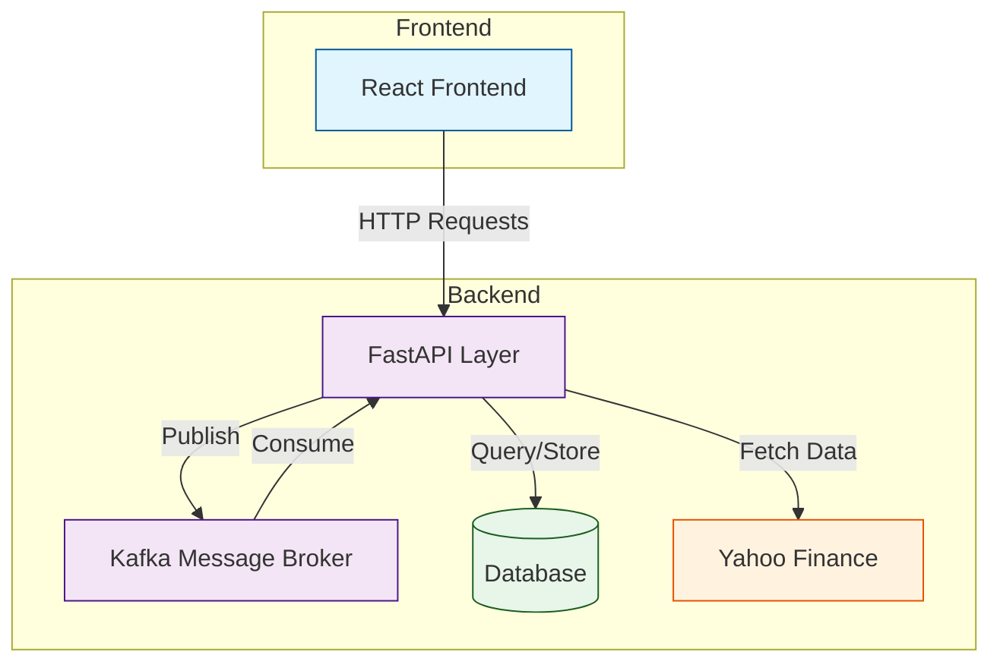
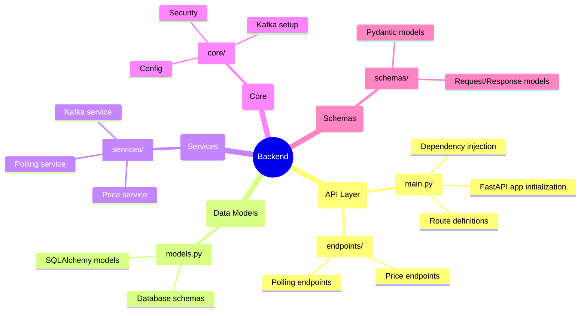
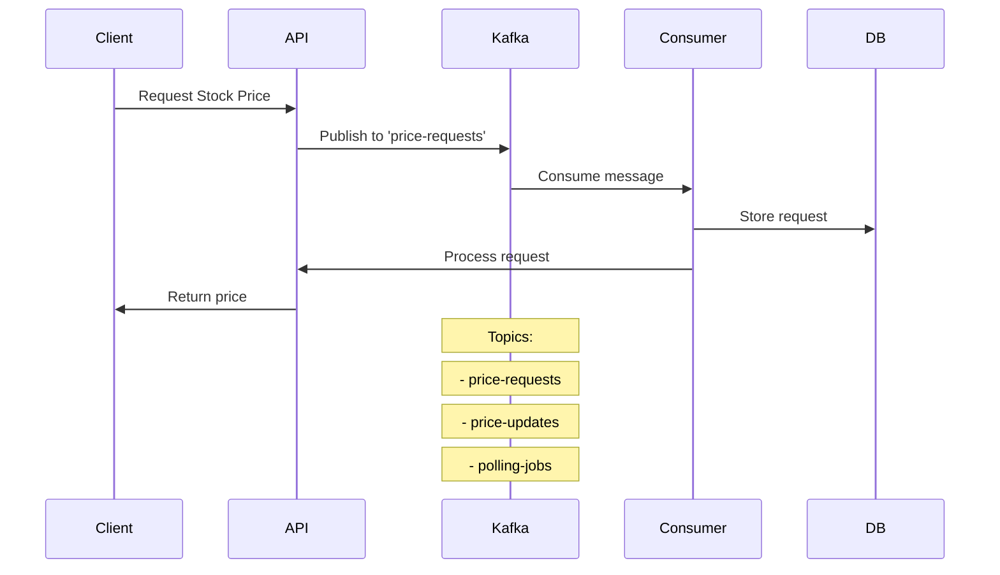
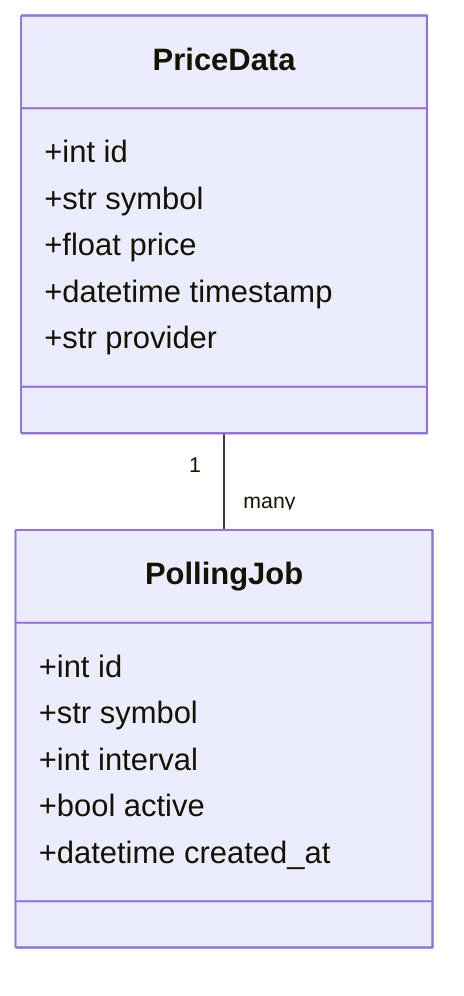
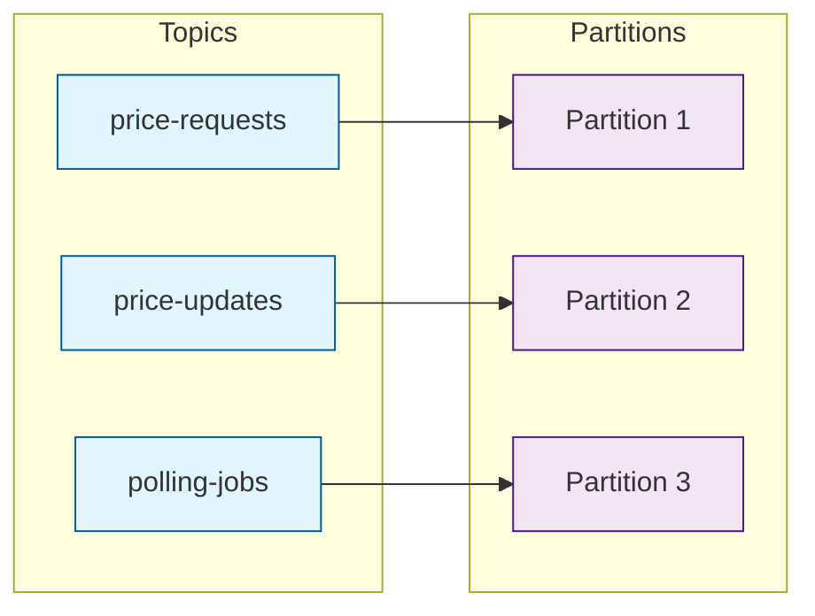
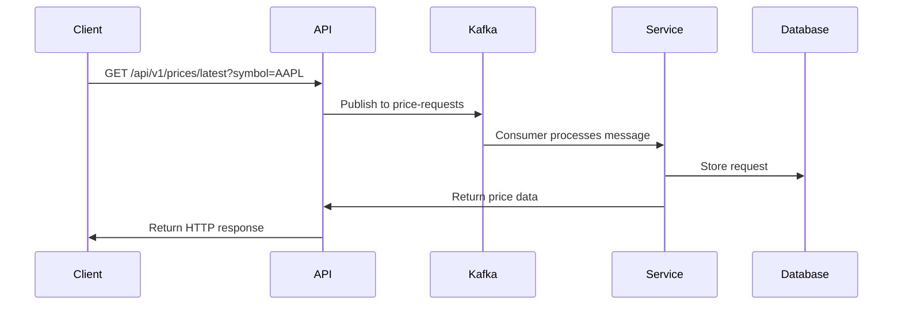
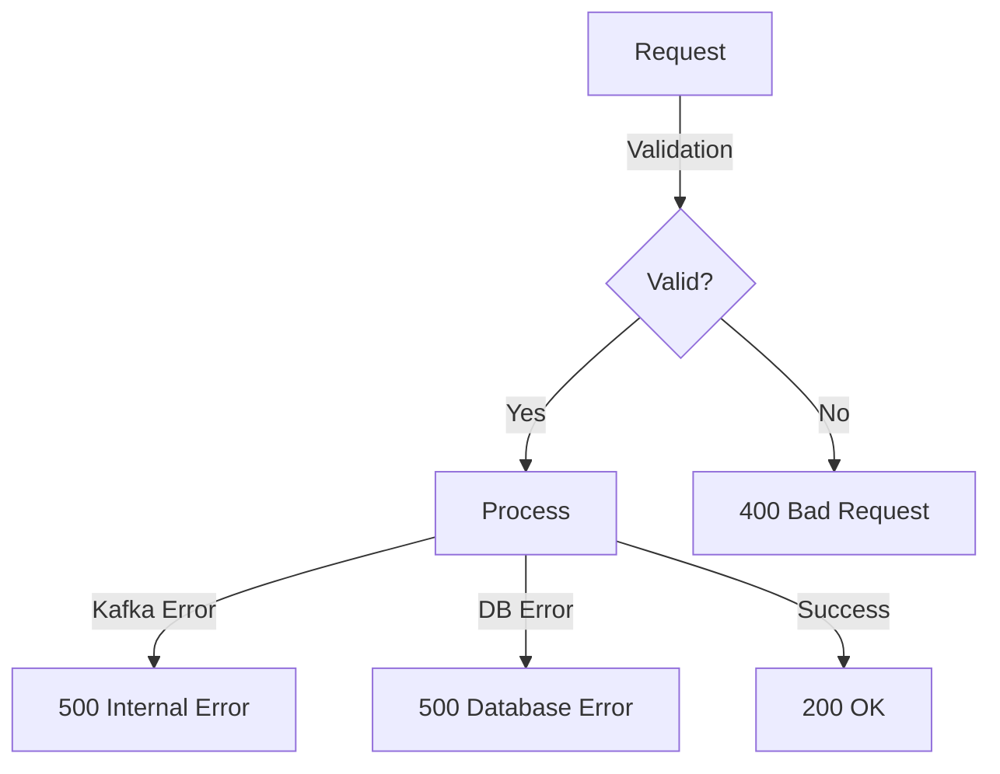
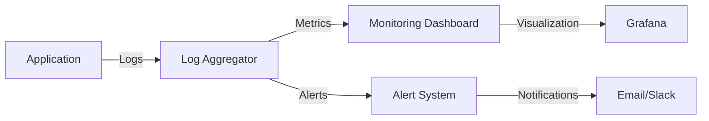

# Backend Architecture Documentation

## 1. Overall Architecture

## 2. File Structure and Responsibilities

### Core Components

## 3. Kafka Integration Flow

## 4. Detailed Component Explanation

### 4.1 API Layer (`api/main.py`)

- Entry point for all HTTP requests
- Defines API routes and endpoints
- Handles request validation
- Manages dependency injection
- Integrates with Kafka producers

### 4.2 Data Models (`models.py`)

### 4.3 Services Layer (`services/`)

- **Price Service**: Handles price fetching and updates
- **Polling Service**: Manages polling jobs and schedules
- **Kafka Service**: Manages message production and consumption

### 4.4 Kafka Topics and Partitions

## 5. Request Flow Example

## 6. Error Handling Flow

## 7. Key Features for Interview Discussion

1. **Scalability**

   - Kafka partitions for parallel processing
   - Database indexing for fast queries
   - Caching layer for frequent requests

2. **Reliability**

   - Error handling at each layer
   - Retry mechanisms for failed requests
   - Data consistency checks

3. **Performance**

   - Asynchronous processing with Kafka
   - Efficient database queries
   - Connection pooling

4. **Security**
   - Input validation
   - Rate limiting
   - Error message sanitization

## 8. Monitoring and Logging

